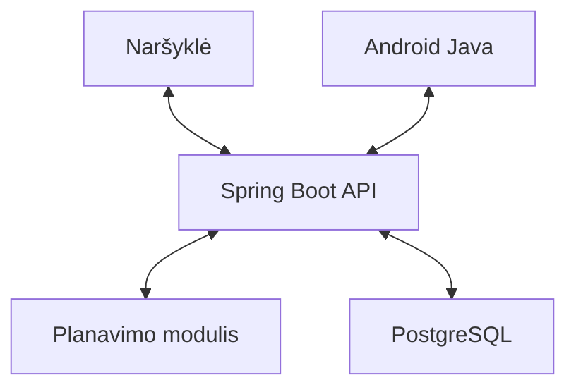

# DoTask – automatinė darbų planavimo sistema

Kursinio darbo I dalis – projektavimo dokumentas

## 1. Problema ir idėja

„DoTask“ skirta studentams, kuriems reikia suderinti kelių užduočių terminus su turimu laiku. Modeliuojamoje situacijoje darbai žymimi sąraše arba kalendoriuje, tačiau jų trukmė ir laisvi intervalai derinami rankiniu būdu. Pasikeitus terminui, grafiką tenka pertvarkyti. Vien užduočių sąrašas neparodo, ar darbams pakaks laiko.

Sistema pagal likusią darbo trukmę ir prieinamumą sudarys sesijų grafiką bei nurodys nesuplanuotą darbą. Studentas valdys savo užduotis ir grafiką, darbo erdvės savininkas – narystes ir bendrus nustatymus. Daroma prielaida, kad trukmę galima įvertinti, o darbą skaidyti į sesijas. Vienam naudotojui vienu metu skiriama viena užduotis.

## 2. Apimtis

| Funkcija | Ką naudotojas galės atlikti | Paskirtis |
| --- | --- | --- |
| Automatinis planavimas | Sudaryti ir perskaičiuoti sesijų grafiką, matyti nesuplanuotą darbą ir jo priežastis | Pagrindinis modulis |
| Užduotys ir prieinamumas | Nurodyti terminus, prioritetus, likusią trukmę, būseną ir laisvus intervalus | Pagalbinė |
| Grafiko peržiūra | Peržiūrėti šiandienos ir būsimas sesijas bei perspėjimus | Pagalbinė |
| Paskyros ir darbo erdvės | Prisijungti, valdyti narystes, vaidmenis ir erdvės nustatymus | Pagalbinė |
| Android programėlė | Valdyti užduotis, peržiūrėti grafiką ir gauti vietinius priminimus telefone | Pagalbinė |

Į apimtį neįeina komandos darbų paskirstymas, užduočių priklausomybės, pasikartojantys darbai, iOS versija, veikimas be ryšio, failų priedai ir integracijos su išoriniais kalendoriais.

Papildomų balų sieksiu už Android programėlę ir matavimais įvertintą antrą kokybės atributą – spartumą. Bendra papildomų balų riba yra +2 [2].

## 3. Pagrindinis modulis

Planavimo modulis sudarys vieno naudotojo grafiką pasirinktoje darbo erdvėje. Įvestis – užduotys su terminais, prioritetais ir likusia trukme, prieinamumas, planavimo pradžia bei erdvės nustatymai. Išvestis – sesijos su užduoties ID, pradžia ir pabaiga, nesuplanuotos minutės ir paaiškinimai.

Taikomas deterministinis godusis algoritmas: užduotys surikiuojamos ir kiekvienai skiriamas ankstyviausias tinkamas laikas. Nesuplanuotas likutis rodo pasirinktos strategijos rezultatą; tai neįrodo, kad kitoks grafikas neįmanomas.

### Veikimo eiga ir taisyklės

1. **Įvesties patikra.** Neatliktos užduoties likusi trukmė, sesijos maksimumas ir dienos limitas turi būti teigiami 15 min. kartotiniai, pertrauka – neneigiamas 15 min. kartotinis. Intervalo pradžia turi būti ankstesnė už pabaigą. Netinkama įvestis atmetama su validavimo klaida, išsaugotas grafikas nekeičiamas.
2. **Laiko intervalų paruošimas.** Planavimo pradžia apvalinama iki artimiausios neankstesnės 15 min. ribos pagal erdvės laiko juostą. Praėjusios intervalų dalys pašalinamos, persidengiantys intervalai sujungiami, kertantys vidurnaktį suskaidomi pagal dienas. Vienu skaičiavimu planuojama iki 30 dienų ir 1 000 užduočių.
3. **Užduočių atranka ir rikiavimas.** Atliktos užduotys praleidžiamos; pasibaigus terminui, likęs darbas grąžinamas kaip nesuplanuotas su paaiškinimu. Kitos užduotys rikiuojamos pagal ankstesnį terminą, aukštesnį prioritetą ir, jiems sutapus, mažesnį ID.
4. **Sesijų paskirstymas.** Užduočiai skiriami ankstyviausi tinkami intervalai, sesijas pradedant 15 min. ribomis. Planavimas tęsiamas, kol paskirstomas likęs darbas arba išnaudojamas laikas iki termino ar laikotarpio pabaigos. Sesijos trukmę lemia mažiausia iš keturių reikšmių: likusi darbo trukmė, sesijos maksimumas, nepanaudotas dienos limitas ir laisvas laikas iki termino. Trukmė apvalinama žemyn iki 15 min. kartotinio; trumpesni tarpai nenaudojami.
5. **Apribojimų taikymas.** Sesijos negali persidengti ar baigtis po termino. Pertrauka išlaikoma ir keičiant užduotį, tikrinant tarpą iki ankstesnės ir vėlesnės sesijos. Pakankamas natūralus tarpas atstoja pertrauką. Dienos limitas apima tik darbo minutes.
6. **Rezultato patikra ir išsaugojimas.** Kiekvienai užduočiai suplanuotų ir nesuplanuotų minučių suma turi sutapti su likusiu darbu. Dalinis grafikas pateikiamas su priežastimis; patikrintas rezultatas išsaugomas viena transakcija. Pakeitus įvestį, naudotojas inicijuoja perskaičiavimą pagal atnaujintą likusią trukmę.

### Įvesties ir išvesties pavyzdys

Planavimo pradžia – 2026-10-05 18:00, darbo erdvės laiko juosta – `Europe/Vilnius`. Prieinamumo intervalai abiem dienomis, spalio 5 ir 6 d., yra 18:00–21:30. Didžiausia sesijos trukmė – 120 min., pertrauka tarp sesijų – 15 min., dienos darbo limitas – 180 min.

| Užduotis | Likusi trukmė | Prioritetas | Terminas |
| --- | --- | --- | --- |
| A – Java laboratorinis | 240 min. | Aukštas | 2026-10-07 21:30 |
| B – UX ataskaita | 120 min. | Vidutinis | 2026-10-06 21:30 |

| Data | Užduotis | Sesija | Trukmė |
| --- | --- | --- | --- |
| 2026-10-05 | B | 18:00–20:00 | 120 min. |
| 2026-10-05 | A | 20:15–21:15 | 60 min. |
| 2026-10-06 | A | 18:00–20:00 | 120 min. |
| 2026-10-06 | A | 20:15–21:15 | 60 min. |

B suplanuojama pirmiau dėl ankstesnio termino. A skiriama 240 min., B – 120 min.; nesuplanuoto darbo nelieka. AI modulio reikalavimai netaikomi, nes planavimas grindžiamas aprašytomis taisyklėmis.

### Scenarijai būsimiems testams

Veiksmas visuose scenarijuose – sudaryti grafiką. Jei nenurodyta kitaip, taikomos pavyzdžio sąlygos. Lentelės datos yra 2026 m.

| Scenarijus | Pradinės sąlygos ir įvestis | Tikslus laukiamas rezultatas |
| --- | --- | --- |
| Įprastas atvejis | Pateikto pavyzdžio užduotys ir prieinamumas | Keturios lentelėje nurodytos sesijos. A suplanuota 240 min., B – 120 min. Nesuplanuoto darbo nėra. |
| Vienodi terminai | Spalio 5 d. 18:00–20:15; A ir B po 60 min., abiejų terminas 20:15. A prioritetas vidutinis, B – aukštas. | B: 18:00–19:00; A: 19:15–20:15. Abi užduotys suplanuotos, tarp jų išlaikyta 15 min. pertrauka. |
| Nepakankamas prieinamumas | Spalio 5 d. 18:00–20:00; A likusi trukmė 240 min., terminas 20:00. | A: 18:00–20:00. Suplanuota 120 min.; dar 120 min. lieka dėl laiko iki termino trūkumo. |
| Dienos limito pasiekimas | Spalio 5 d. 18:00–22:30; A likusi trukmė 240 min., terminas 22:30. | A: 18:00–20:00 ir 20:15–21:15. Suplanuota 180 min.; 60 min. lieka dėl dienos limito. |
| Klaidinga įvestis | Išsaugotas pavyzdžio grafikas; A likusi trukmė pakeičiama į −15 min. | Grąžinama trukmės validavimo klaida. Išsaugotas grafikas lieka nepakeistas. |

Papildomi testai apims praleistus terminus, rikiavimą pagal ID, persidengiantį prieinamumą ir atliktas užduotis. Bus tikrinamos trukmių sumos, persidengimai, pertraukos ir terminai.

## 4. Kokybės atributai

### Pagrindinis atributas – palaikomumas

Planavimo politika gali keistis, todėl rikiavimo strategija bus perduodama per Java `Comparator`. Naują strategiją bus galima pridėti nekeičiant sesijų paskirstymo. Modulis nepriklausys nuo API ir bazės.

Pakeitimo scenarijus – pridėti strategiją „prioritetas, terminas, ID“. Prieinamumas: 2026-10-05 18:00–20:15; abi užduotys po 60 min., pertrauka 15 min. A prioritetas žemas, terminas spalio 6 d.; B – aukštas, terminas spalio 7 d. Pradinė strategija turi skirti A 18:00–19:00 ir B 19:15–20:15, naujoji – B 18:00–19:00 ir A 19:15–20:15.

Sėkmės kriterijus: pakeista 0 esamų algoritmo ir strategijų failų, naujas scenarijus sėkmingas, ankstesni testai su pradine strategija tebeveikia. Įrodymai – Git pakeitimų palyginimas ir JUnit rezultatai. Reikės strategijų parinkimo konfigūracijos; nauji laiko apribojimai gali pareikalauti algoritmo pakeitimų.

### Antras atributas – spartumas

Perskaičiavimas turi būti pakankamai greitas interaktyviam naudojimui. Bus generuojami 100, 500 ir 1 000 užduočių rinkiniai su fiksuota generatoriaus pradine reikšme 42. Sąlygos: 30 dienų nuo 2026-10-05 su prieinamumu 18:00–22:30, trukmės 15–240 min. kas 15 min., prioritetai 1–3, terminai tame laikotarpyje. Sesijos maksimumas, dienos limitas ir pertrauka – kaip 3 skyriuje.

| Patikrinimas | Sėkmės kriterijus |
| --- | --- |
| Planavimo modulis: 1 000 užduočių, 20 įšilimo iškvietimų ir 100 matavimų | p95 ≤ 500 ms |
| API: 5 naudotojai po 500 užduočių, 100 perskaičiavimo užklausų, iki 5 vienu metu | p95 ≤ 1 500 ms; klaidų nėra |

Duomenys bus atrenkami pagal erdvę ir naudotoją, užduotys rikiuojamos kartą, laikas paskirstomas atmintyje. Matavimams naudosiu JUnit ir JMeter; pateiksiu medianą, p95, klaidų skaičių, aparatinę įrangą ir programinės aplinkos versijas. p95 – riba, kurios neviršija 95 % matavimų. Duomenų paruošimas ir įšilimas neįtraukiami į modulio laiką. Įvesties apimtį riboja atmintis, o sintetiniai bandymai neapims visų realių apkrovų.

## 5. Pradinė sistemos struktūra

Naršyklė ir Android programėlė pateiks įvestį tam pačiam API ir rodys sesijų sąrašą. API tikrins prieigą, kvies planavimo modulį ir išsaugos rezultatą. Planavimas vyks serveryje; PostgreSQL saugos erdves, narystes, užduotis, prieinamumą, nustatymus ir grafiką.

Serveriui ir Android programėlei pasirinkta Java. Spring Boot palengvins REST API kūrimą, Spring Security – prieigos tikrinimą [3]. PostgreSQL tinka susijusiems duomenims ir transakcijoms. Naršyklei pakaks HTML, CSS ir JavaScript. Android sąsaja bus kuriama XML su Android Studio, ryšiui naudojamas Retrofit [4, 6]. Įrankiai: JUnit, Maven serveriui, Gradle Android projektui ir Git.

Prieiga bus tikrinama pagal `tenant_id`, narystę ir prisijungusio naudotojo ID. Savininkas valdys narius, sesijos maksimumą, pertrauką ir dienos limitą; narys – savo užduotis ir prieinamumą. Dviejų erdvių testai turi patvirtinti, kad svetimų duomenų negalima perskaityti ar pakeisti.

API naudos JWT, prisijungimo sesijų atmintyje nesaugos. Docker Compose paleis API ir bazę viena README aprašyta komanda. Konfigūracija ir paslaptys bus perduodamos aplinkos kintamaisiais.

Android APK apims prisijungimą, užduočių ir prieinamumo formas, grafiką, perskaičiavimą ir darbo pažymėjimą atliktu. Atnaujinus grafiką, ankstesni vietiniai priminimai bus atšaukiami ir pakeičiami naujais. Emuliatoriuje ir telefone tikrinsiu ryšio klaidas, atnaujinimą bei pranešimų leidimo suteikimą ir atsisakymą [5]. Atsisakius leidimo, grafikas liks pasiekiamas; naujam planui reikės ryšio.

## 6. AI panaudojimas

ChatGPT ir Codex naudoti dokumentui rengti ir peržiūrėti. Panaudoti struktūros ir testų scenarijų pasiūlymai; veikimo eiga perrašyta tikslinant algoritmo taisykles. Komandos darbų optimizavimo atsisakyta dėl apimties. Dokumentas ir pavyzdžiai tikrinti pagal užduoties aprašą, šabloną ir dėstytojo skaidres.

Codex asistentą naudosiu Java kodui ir testams rašyti bei refaktorizuoti. Pasiūlymus tikrinsiu pagal oficialią dokumentaciją ir testais; fiksuosiu priimtus, atmestus ar perrašytus sprendimus bei priežastis. AI gali pasiūlyti neteisingą API arba praleisti ribinius atvejus. Turėsiu gebėti paaiškinti ir pakeisti kodą bei pagrįsti dokumento teiginius. Sistemoje AI funkcijos nebus.

## 7. Tolesnių darbų planas

| Eilė | Darbas iki prototipo | Apčiuopiamas rezultatas |
| --- | --- | --- |
| 1 | Parengti repozitoriją ir duomenų modelį | Java projektas ir pradinė bazės schema |
| 2 | Įgyvendinti planavimo modulį | Algoritmas ir penki scenarijų testai |
| 3 | Sukurti API ir duomenų išsaugojimą | Prisijungimas, dvi darbo erdvės ir izoliacijos testai |
| 4 | Sukurti naršyklės sąsają | Įvesties formos, sesijų sąrašas ir perskaičiavimas |
| 5 | Parengti paleidimą ir demonstraciją | Docker Compose, README ir pavyzdiniai duomenys |

Iki 2026-11-16 planuojamas prototipas, iki 2026-12-14 – Android programėlė ir kokybės patikrinimai [2]. Prototipo demonstracijoje bus naudojama 3 skyriaus įvestis ir parodytos keturios numatytos sesijos. Pašalinus spalio 6 d. prieinamumą ir perskaičiavus, turi likti spalio 5 d. B 18:00–20:00 ir A 20:15–21:15; A nesuplanuota trukmė – 180 min.

| Rizika arba neaiškumas | Kaip bus sumažinta ar patikrinta |
| --- | --- |
| Netiksliai įvertinta trukmė ir godžiojo algoritmo ribotumas | Naudotojas galės keisti likusią trukmę; dalinis grafikas rodys likutį, testai tikrins apribojimus. |
| Android integracija ir priminimai | Dar iki prototipo bus išbandytas ryšys su API ir vienas priminimas telefone. |
| Apimties augimas ir prieigos klaidos | Pirmiausia bus užbaigtas modulis ir dviejų erdvių izoliacijos testai; papildymai naudos tą patį API. |

### Šaltiniai

[1] „1-etapo-uzduoties-aprasymas.pdf“ ir „1-etapo-pateikimo-sablonas.pdf“.

[2] „Kaip-ir-kas.pdf“, skaidrės 16–18 ir 47–48.

[3] [Spring REST](https://spring.io/guides/gs/rest-service/); [Spring Security JWT](https://docs.spring.io/spring-security/reference/servlet/oauth2/resource-server/jwt.html).

[4] [Android projekto kūrimas](https://developer.android.com/studio/projects/create-project).

[5] [Android pranešimų leidimai](https://developer.android.com/develop/ui/views/notifications/notification-permission).

[6] [Retrofit](https://github.com/square/retrofit). Interneto šaltiniai peržiūrėti 2026-10-03.
